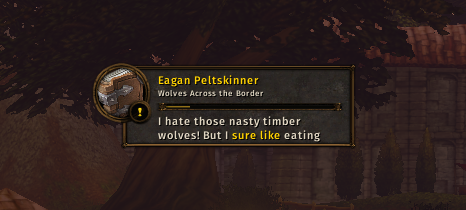

# Quest captions

Spoken can show one or two lines of quest and NPC dialogue inside the player.
The captions follow the recording and highlight two adjacent words in gold.
They move, resize and scale with the player in both layouts.



The screenshot above is from WoW Forever on Linux. The player confirmed the
layout and approximate timing in game. Other clients have not been checked
visually.

## Controls

- `/spoken transcript` toggles captions; `on` and `off` also work.
- `/spoken transcript 1` shows one line; `/spoken transcript 2` shows two.
- `/spoken options` has settings for line count, font size, highlighting and
  automatic following.
- Scroll over the captions to read other pages. Click the text to follow the
  recording again. Right-click opens the player menu, or settings in the
  original layout.
- `/spoken transcript reset` restores the caption defaults.

Pausing freezes the text. Resuming restarts it with the recording. Skipping
shows the next clip's text, and a clip without text hides the captions.

## Timing and text

The sound packs have recording durations but no word timestamps. Timing is
estimated from word length, punctuation and the total duration. Two neighboring
words are highlighted to give the estimate some room. At the end of a page,
the previous word stays highlighted instead of advancing the page early.

Captions use the text captured when a quest or gossip clip was queued. Quest
log replays can use the quest description. A completion recording never uses
the acceptance text as a substitute. Different quest wording and pauses in a
recording can still make the highlight drift.

Books and zone lore do not provide caption text yet. Other sources can supply
`clip.present.transcript`; the player also accepts the existing `clip.text`.

## Checks

Run from the repository root:

```sh
make test-player
node scripts/check-addon-xml.mjs
```

The caption suite is `tests/captions/verify.lua`. It runs the real queue,
player layouts, actions and quest adapter with simulated widgets and time.
It checks playback changes, page boundaries, Unicode, resizing, attachment,
queue placement and settings. The fixture models layout and text width; it
does not reproduce the game's font rendering or audio.
